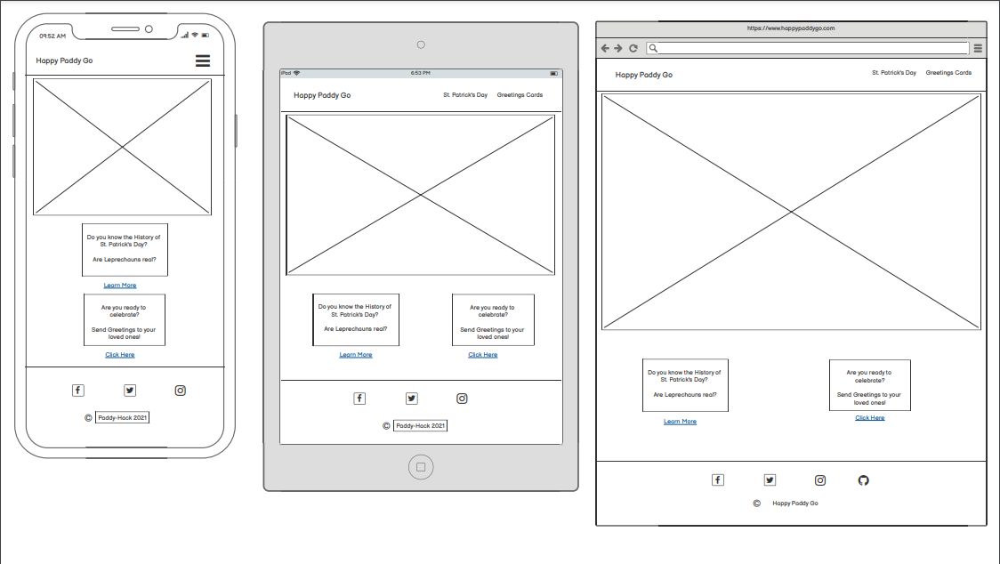
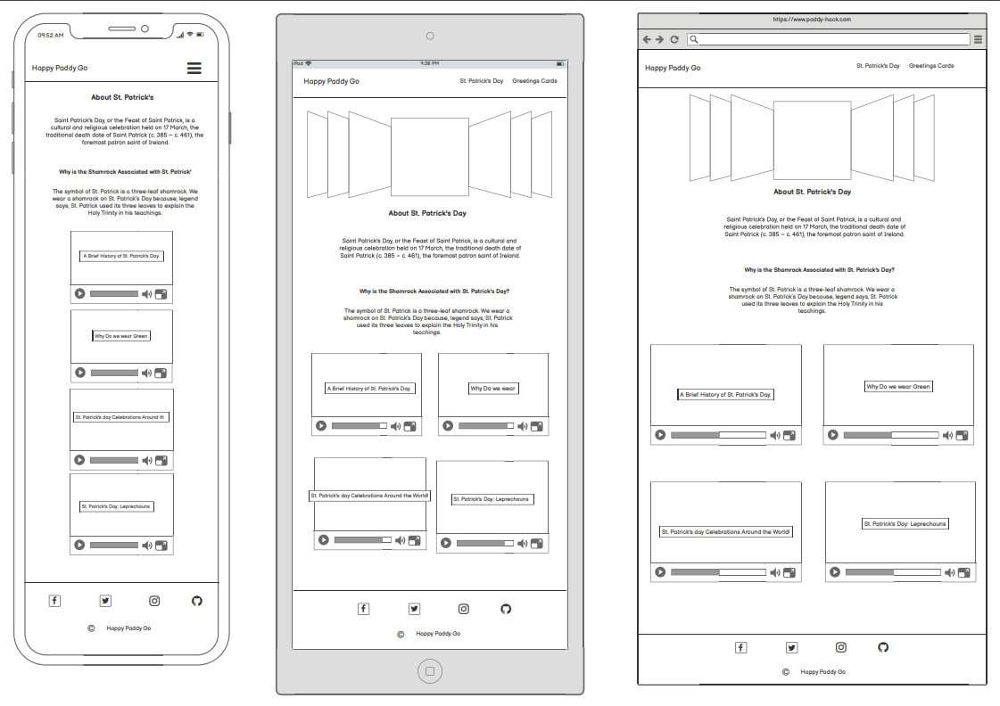
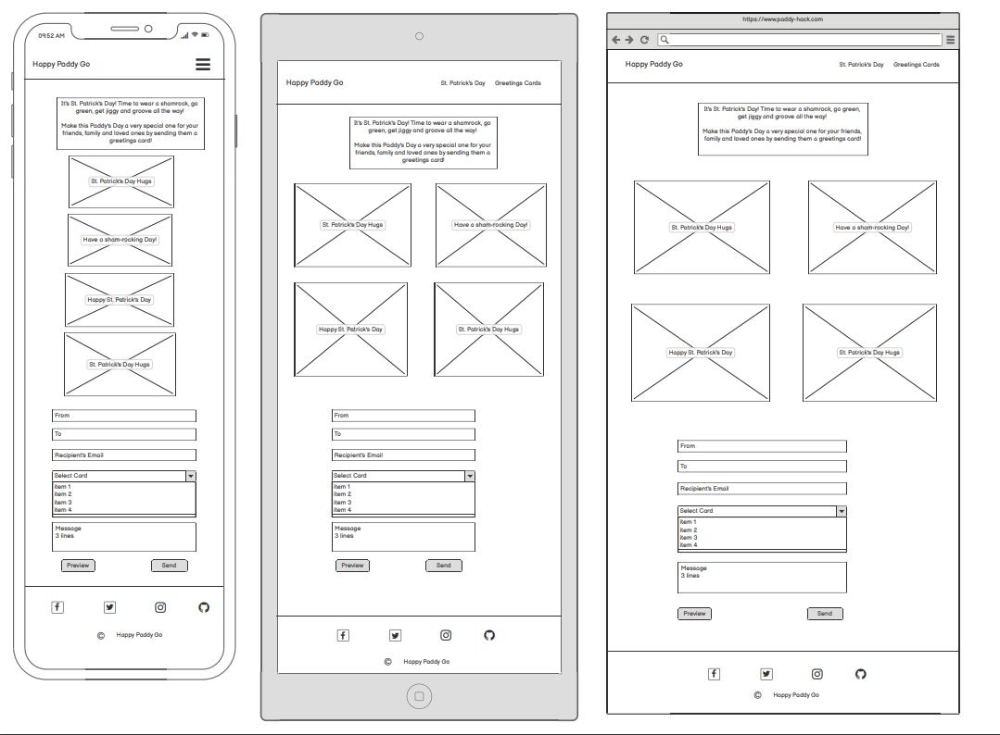

# happypaddygo

To visit live website, [click here.](https://paddy-hack-team.github.io/happypaddygo/)

# User Experience (UX)

### User stories

- #### First Time Visitor Goals

  - As a First Time Visitor, I want to easily understand the main purpose of the site and learn more about St. Patrick's Day.
  - As a First Time Visitor, I want to be able to easily navigate throughout the site to find content.
  - As a First Time Visitor, I want to have the option to watch videos related to St. Patrick's Day from all over the world.
  - As a First Time Visitor, I want to send e-cards to loved ones.

- #### Returning Visitor Goals

  - As a Returning Visitor, I want to see if there is new information and new cards about St. Patrick's Day.

- ### Design

  - #### General

    - This webpage was created as a mobile first, giving the appearence of an app with cards containing the content. If opened in devices with larger screen, the cards are going to be resized and be shown in 2 columns, this make the site easier to mantain if necessary to include or remove cards.

  - #### Colour Scheme

    - The website was created using the Irish colors of Green and white. The fonts are in green and correspond nicley with the white background color. This color scheme also reflects the St. Patrick's Day colors.

  - #### Typography

    - The Marck Script is the main font used throughout the whole website with Roboto in the Menu items, footer and paragraphs. To keep this site consitent Open Sans is used as the fallback font in case for any reason the font isn't being imported into the site correctly.

  - #### Imagery

    - Imagery is very important and we used that throughout our site to present a visually appeal webiste.
    - Videos are used for the same reason to enhance the user experience.

  - ### Wireframes

    - Home Page Wireframe - 
    - St.Patrick's Day Page Wireframe - 
    - Greetings Cards Page Wireframe -

# Features

The website features a header with a logo on the left and navigation bar with menu items on the left. It aslo features a footer with social media icons and copyright information. The header and footer maintain consistency on all pages.

## Home

The **Home** page allows the user to have ease of access and navigation to all other pages, from the navigation bar, the user can navigate to **St.Patrick's** page and **Greetings Cards** page links to other pages and social media platforms in the footer of the page.

The **Home** page fetaure a hero image with call to action message.

The Home page also features two card indexes that will direct the user to the St.Patrick's page and the Greetings Cards page respectively.

## St. Patrick's Day

The **St.Patrick's Day** page features information about St.Patrick's day. This is the "About page."

The Hero images in this page are displayed as a carousel of images with a slider.

The page also features embeded youtube videos with various information around the St.Patrick's Day celebrations and traditions around the world.

## Greetings Cards

The **Greetings Cards** page features six clickable cards which navigate the user to a form for each card when cliked. This allows for the user to have a seemless experience as each card opens up in a separate page with a form which the user can send.

This also allows the user to open up several cards in separate windows and gives them the ability to send multiple cards to multiple people.

# Technologies Used

This project is created with:

- HTML5 - used for building the website
- CSS3 - for styling elements
- JavaScript
- Google Fonts - Roboto, Marck Script used for the font-family and Open Sans as the fall-back.
- Font Awesome - for Icons.
- Materialize CSS - Used for elements, components and styling of the page.
- Visual Studio Code - Text editor for coding
- GitHub - Used for hosting the code, project management and version control.
- GitHub Pages - This is where the site is deployed.

# Testing

## User Stories

## Links

- Each navbar link worked correctly, in both the mobile navbar and the expanded desktop navbar in all pages.
- The links of the social pages in the footer works correctly in all the website pages opening a new page.
- The the navbar logo works correctly by redirecting the user to the homepage.
- The carousel button in the about page works correctly, showing each one a different picture.
- The four youtube videos in the about section can be played without problem.
  Tested Carousel right and left arrows and the right arrow moves to the next image and left arrow moves to the previous image as desired.

## Responsive Design

## Validators

## Grammar and spelling

## Lighthouse

# Deployment

## GitHub Pages

The project was deployed to GitHub Pages using the following steps...

1. Log in to GitHub and locate the [GitHub Repository](https://github.com/Paddy-Hack-Team/happypaddygo)
2. At the top of the Repository (not top of page), locate the "Settings" Button on the menu.
3. Scroll down the Settings page until you locate the "GitHub Pages" Section.
4. Under "Source", click the dropdown called "None" and select "Master Branch".
5. The page will automatically refresh.
6. Scroll back down through the page to locate the now published site [link](https://paddy-hack-team.github.io/happypaddygo/) in the "GitHub Pages" section.

## Collaboration

- Each navbar link worked correctly, in both the mobile navbar and the expanded desktop navbar in all pages.
- The links of the social pages in the footer works correctly in all the website pages opening a new page.
- The the navbar logo works correctly by redirecting the user to the homepage.
- The carousel button in the about page works correctly, showing each one a different picture.
- The four youtube videos in the about section can be played without problem.
  Tested Carousel right and left arrows and the right arrow moves to the next image and left arrow moves to the previous image as desired.

## Responsive Design

## Accessibility

## Validators

## Grammar and spelling

## Lighthouse

# Deployment

This project has been deployed on GitHub Pages by the Admin with the following process:

- All code was written on Gitpod, an online IDE.
- The code was then pushed to GitHub where it is stored in my Repository.
- Under the settings section of the GitHub repository, scrolled down to GitHub Pages section.
- Under 'Source' drop-down, the 'Master branch' was selected.
- Once selected, this publishes the project to GitHub Pages and displays the site url.
- There is no difference between the deployed version and the development version.
- The code can be run locally through clone or download.
- You can do this by opening the repository, clicking on the green 'Code' button and selecting either 'clone or download'.
- The Clone option provides a url, which you can use on your desktop IDE.
- The Download ZIP option provides a link to download a ZIP file which can be unzipped on your local machine.

This project has been deployed on GitHub Pages by the Admin with the following process:

- All code was written on Gitpod, an online IDE.
- The code was then pushed to GitHub where it is stored in my Repository.
- Under the settings section of the GitHub repository, scrolled down to GitHub Pages section.
- Under 'Source' drop-down, the 'Master branch' was selected.
- Once selected, this publishes the project to GitHub Pages and displays the site url.
- There is no difference between the deployed version and the development version.
- The code can be run locally through clone or download.
- You can do this by opening the repository, clicking on the green 'Code' button and selecting either 'clone or download'.
- The Clone option provides a url, which you can use on your desktop IDE.
- The Download ZIP option provides a link to download a ZIP file which can be unzipped on your local machine.

# Credits

Below are the resources that were used.

- [Materialize](https://materializecss.com/) - A modern responsive front-end framework based on Material Design used for styling CSS.
- [Pexels](https://www.pexels.com/) - Used for free stock photos
  - [Darlene Alderson](https://www.pexels.com/@darlene-alderson)
  - [Jill wellington](https://www.pexels.com/@jill-wellington-1638660)
  - [Anna Shvets](https://www.pexels.com/@shvetsa)
  - [Sudipta Mondal](https://www.pexels.com/@sudipta)
  - [Pressmaster](https://www.pexels.com/@pressmaster)
- Youtube
  - [ABC News](https://www.youtube.com/watch?v=40BlVzjxu-I)
  - [Home of the Holidays](https://www.youtube.com/watch?v=BBE_aW7Bsn4)
  - [Reading Through History](https://www.youtube.com/watch?v=HFch06rGKXw)

# Acknowledgements

This webiste was created through guidance from our mentor Chris, team efforts, effective and efficient collaboration and communications from the team member below.

- Fabio De Araujo
- Magda Ruszaj
- Alessandro Commentucci
- Joan Amudu
- Mike Casey
- Fiachra Holland
